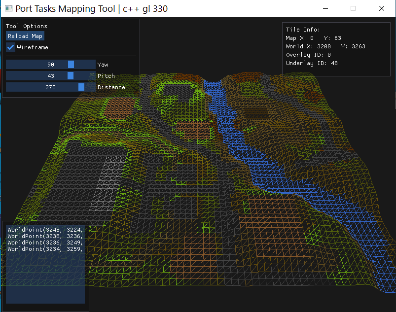

# PortTasksMapper

**PortTasksMapper** is a lightweight C++ tool using OpenGL 3.3 to render Old School RuneScape maps and overlay WorldPoint paths. Built for visualization and exporting path data for use in the Port Tasks RuneLite plugin.

## Features
- OpenGL 3.3
- Tile overlay and manual WorldPoint path tracing
- Export path data for use in RuneLite plugins
- Simple cross plat (GLFW, GLAD, ImGui)
- Soon: RS2 map region loading